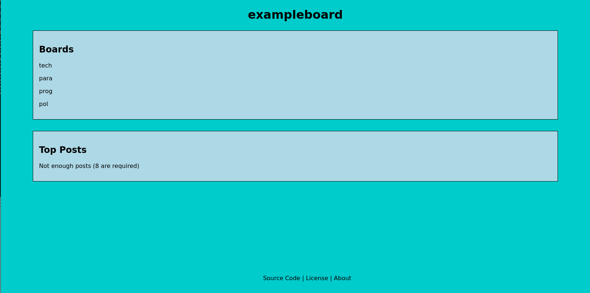

# openboard

Light, libre image board technology written in vanilla PHP that can be slightly customized.



The basic features of an image board are supported:

* Numerous boards
* Posts with images
* Comments (with optional images) on posts
* Admin features to manage posts
* Block specific IP addresses

These features are handled through a REST API, so different frontends can be used for
one instance. However, openboard comes with a simple web frontend.

## Tech Stack

### Frontend

HTML, CSS, basic and unrequired JavaScript. This is the default interface but it can be
replaced as mentioned earlier.

### Backend

Vanilla PHP for server-side rendering and microservices

### Database

MySQL or MariaDB

## Setup and Configuration

openboard is meant to run with two seperate web servers:

1. The REST API and DBMS to handle data requests.
2. Retrieve data from the backend and render HTML.

Doing so allows for scalability and avoids pointless HTTP requests to the localhost when
using a web frontend. However, you can run it on one host just fine.

Run this statement in your MySQL or MariaDB DBMS before using openboard:
`CREATE DATABASE openboard;`

The image board name, individual board names, database information, and other aspects of
openboard can be configured in `config.json`, which is stored in the base directory of it's
Git repo.

No JSON key/value pairs should be removed at all as every option is used and relied on
for full functionality.

### config.json Explanation 

```
	// Some settings will already be set with defaults. You can leave those if they
	// are appropriate for your configuration, or you can change them as needed.

	"index": {
		// These settings are for defining values that will be
		// used through the entire website.
	}

	"database": {
		// Vital for database connectivity, without which openboard
		// cannot function. Do not leave any of these empty. You must
		// also make sure that these are correct in accordance with your DBMS.
	}

	"style": {
		// Colors for various aspects of openboard.
	}
```
